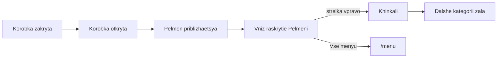

# ПельМесто — спецификация сайта для разработки

Документ для Cursor и программиста. Единый источник правды по BA и SEO на 02.09.2026 (ответы BA Ирина + карточки Марины по заморозке + семантика по подсказкам). Файлы в `mat/`, `docs/вопросы-заказчику.md` и `docs/shop-recipes.md` — сырьё; **код писать только по этому файлу** (рецепты — не выдумывать, брать из shop-recipes).

Если решение ниже помечено **зафиксировано** — не переспрашивать и не менять без BA. Если **допущение** — можно верстать, перед продом сверить. Если **позже** / **спросить** — не выдумывать в интерфейсе.

---

## 0. Как пользоваться в Cursor

1. Открыть папку `Pelmesto` как workspace.
2. В начале работы прочитать этот файл целиком и `AGENTS.md`.
3. Не подтягивать визуал wok.by, агрегаторов, тёмных «премиум» шаблонов, столовых. **Вход и меню — тестовые три экрана** (§4.1): коробка → пельмень → хинкали. Не заменять это видео зала или каруселью Strekoza.
4. Не выводить алкоголь ни в меню, ни в мета, ни в alt, ни на фото-акцентах бара.
5. Заморозку заказывают в зале или по телефону; на сайте — каталог, шторка «как приготовить», `tel:`.
6. Не публиковать Wi‑Fi имя/пароль с разворота меню.
7. Два главных пути: **зал поесть** и **заморозка домой**. **Зал чуть важнее** витрины (вес в Title, H1, внутренних ссылках). Готовая доставка — вторична (своих курьеров нет).
8. Фото блюд и интерьера **добавляет разработчик** (админка). BA не ждёт пакет съёмки в этом файле; сток не подставлять.

Стек не зафиксирован. Если не задан — современный SSG/SSR (Next.js / Nuxt / Astro) + адаптив mobile first. **Админка в v1** (меню зала и витрина заморозки).

---

## 1. Продукт

| Поле | Значение | Статус |
|---|---|---|
| Название на сайте | **ПельМесто** (в бегущем тексте можно «Пельместо») | зафиксировано |
| Транслит / доменный корень | Pelmesto / pelmesto | допуск |
| Город | Гомель, Беларусь | зафиксировано |
| Адрес гостю (NAP) | ул. Советская, **44** | зафиксировано |
| Юр. адрес / этикетки | ул. Советская, **44/12**, индекс **246022**; в подвале — пом. 12 | зафиксировано |
| Ориентир | центр, рядом цирк; остановки «Фабрика 8 Марта», «Цирк» | допуск с карт |
| Координаты | 52.43581, 31.00687 | допуск (дом 44), сверить с карточкой на Яндекс/Google |
| Телефон | +375 29 550-55-45 | зафиксировано (этикетки + каталоги) |
| Instagram | [pelmesto_gomel](https://instagram.com/pelmesto_gomel) | зафиксировано |
| WhatsApp / MAX | неизвестно | спросить |
| Сайт сейчас | нет; в каталогах стоит Instagram | зафиксировано |
| С основания | 2021 (логотип) | зафиксировано |
| Формат | кафе-пельменная, одна точка; ручная лепка; грузинская линия (хинкали) | зафиксировано |
| Посадка | 20–30 мест | допуск (Citymix) |
| Веранда / терраса | да в каталогах | допуск |
| Детская комната | да в каталогах | допуск |
| Дети | **акцентируем сильно**: до 6 лет пельмени с куриным филе бесплатно при взрослой порции (продающий ход) | зафиксировано |
| Парковка | неизвестно | спросить |
| Сеть | нет, одна точка | зафиксировано |
| Язык сайта | только русский | зафиксировано |
| Юрлицо | ООО «Изысканная кухня», УНП **491332090** | зафиксировано |
| Касса iiko / r_keeper | не наша зона | позже |
| Админка | **в v1**: меню зала и магазин заморозки | зафиксировано |
| Бронь | по телефону; на сайте не делаем (почти не бронируют) | зафиксировано |
| Сертификат | только купить в зале; на сайте — упоминание без формы заявки | зафиксировано |
| Домен / Метрика / GA4 / карты | заводим мы | зафиксировано |
| Средний чек зала | 20–40 BYN | допуск каталогов |
| Приоритет SEO | **Зал чуть важнее** магазина заморозки | зафиксировано (BA, 02.09) |
| Фото | Добавляет разработчик / админка; в spec нет пакета съёмки | зафиксировано |

### Позиционирование

**H1 / формула (зафиксировано, из меню):**  
Забота, которую можно съесть.

Подзаголовок (тон меню, не слоган-крик):  
Пельмени, вареники, хинкали и чебуреки ручной лепки. Гомель, Советская, 44.

ПельМесто — не столовая и не «ресторан люкс». Домашний уют, честный продукт, живое общение, скорость. Цветное тесто на овощных соках — часть характера, не цирк.

Из брендбука официанта (тон сервиса, не копипаст на hero): место с душой; без усилителей вкуса как обещание бренда; гостей встречают как своих; детям можно.

**Не обещать:** сеть, франшиза, лучшие в городе, премиум/люкс, банкетный зал, парковка (пока не подтвердят), «без ароматизаторов» на всех позициях (у ванильных сырников на этикетке ванилин).

**Не путать с UMI:** здесь дети — сила и акцент; бронь на сайте не строим; два главных CTA — зал и заморозка домой, **зал чуть важнее**.

Кухня по факту: русская/домашняя лепка + хинкали (грузинская линия) + завтраки (сырники, блины, кофе с 09:00). Живой язык поиска — §5 «Спрос → URL», не выдуманные кластеры.

Сегмент: casual, семейный, средний чек. Визуал может быть аккуратнее чека (кольцо с пельменем, Caparol), слова — простые.

---

## 2. Часы

### Зал (допуск с каталогов: 09:00–22:00)

| День | Часы |
|---|---|
| Пн–вс | 09:00–22:00 |

### Кухня и заморозка (зафиксировано)

Кухня **перестаёт принимать заказ за 20 минут до закрытия**. Если зал до 22:00 — последний заказ **21:40**.  
Заморозка в зале — **те же часы**, что кухня.

На сайте у часов подпись: «Кухня и заморозка — до 21:40» (или «за 20 минут до закрытия», если часы зала сверят иначе).

### Доставка готового

Своих курьеров **нет** (зафиксировано). Гость заказывает доставку сам (агрегаторы). Ссылки агрегаторов на сайт — когда будут канонические URL; пока блок логотипов не показывать.

### Завтрак (зафиксировано)

Отдельного сета нет. Просто утренние позиции: сырники, блины, кофе. Открытие в 09:00. Не писать «бизнес-завтрак 9–12».

---

## 3. Что делает сайт v1

Два главных действия (**зафиксировано**): **прийти в зал поесть** и **взять заморозку домой**. Зал **чуть важнее** (SEO и порядок блоков после слайдера: дети → домой, не наоборот).  
Готовая доставка — справочно (своих курьеров нет). Бронь на сайте не делаем.

| Входит в v1 | Не входит в v1 |
|---|---|
| Визитка зала, меню карточками, сильный акцент на детях | Шторка / форма брони |
| Каталог заморозки: меню + этикетки, цены из меню | Эквайринг, онлайн-касса, своя доставка |
| Админка: блюда, цены, витрина «домой» | Telegram-бот как канал заявок |
| `tel:` как заказ заморозки и единственный «бронь» | Личный кабинет, бонусы, промокоды |
| Карта, отзывы, о нас, ручная лепка | Интеграция iiko / r_keeper |
| SEO-страницы категорий зала и магазина, котлеты/тефтели/голубцы в магазине | Алкоголь в любом виде |
| Сертификат: текст «покупают в зале», без формы | Форма заявки на сертификат |
| Политика ПДн (реквизиты есть) | SMS «заказ принят» |
| Домен, Метрика, GA4, карточки карт — заводим мы | Отдельные лендинги на улицы города |

---

## 4. Визуал (для вёрстки до макетов)

Палитра заказчика (Caparol, **зафиксировано** как доноры цвета, не как заливка всего экрана):

| Имя | RGB | Hex | Роль |
|---|---|---|---|
| Verona 105 | 92, 145, 149 | `#5C9195` | акцент, шапка, ссылки |
| Curcuma 75 | 222, 184, 104 | `#DEB868` | тепло, хиты, цветное тесто |
| Parma 14 | 219, 168, 165 | `#DBA8A5` | мягкий второй акцент (как пыльная роза на лого) |
| Jura 45 | 184, 180, 174 | `#B8B4AE` | нейтраль, подложки |

- Фон hero/меню: белый + **паттерн цветных пельменей** (жёлтый / розовый / зелёный) и два треугольника Verona / Parma — как в тестовых экранах. Не заливать весь сайт ювелирной коробкой.
- Логотип-метафора: пельмень в кольце внутри коробки. На шапке слово **ПельМесто** (в прототипе латиница `Pelmesto` — на проде кириллица, если не решим иначе).
- Цветное тесто — в паттерне и в еде; не кислотная радуга в кнопках.
- Текст и цены — всегда непрозрачные, тёмный контраст.
- Fallback: `prefers-reduced-motion` — без полёта коробки: сразу открытая коробка или слайд категории. Учитывать `prefers-reduced-transparency`.
- Hero: **не** статичное фото зала и **не** видео. Сцена — анимация коробки (§4.1).
- Съёмка блюд и интерьера — **зона разработчика / админки**, не дыра BA. Пока нет кадра — плейсхолдер в цветах Caparol, не сток «пельмени из Пинтереста».
- Списки категорий: имя, вес, цена; бейдж «топ» только у позиций из §7. В тестовом экране «топ» на индейке — **не брать**.
- Аппетитные абзацы из макета («Делаем из лучшего свежего фарша…», «сочная начинка…») — **черновик, не публиковать**. Не выдумывать замену без BA.
- Написание: **хинкали**, **вареники**, **чебуреки**, **сырники**, **пельмени**. Бренд: **ПельМесто**.

### 4.1. Тестовые три экрана (зафиксировано)

Кадры: `docs/screens/01-hero-box-open.jpg`, `02-menu-pelmeni.jpg`, `03-menu-khinkali.jpg`.

Последовательность:

1. **Старт.** Коробка **закрыта** (кадра в папке нет — дорисовать в том же ракурсе, что открытая).
2. Коробка **открывается** (бирюзовый бархат, пельмень в кольце на чёрной подушке). Крупно сзади слово «Пельместо», углы: Verona сверху справа, Parma снизу слева.
3. Пельмень **приближается**.
4. Уезжает **вниз** и **раскрывается** (exploded: тесто сверху / начинка / тесто снизу) — это слайд **«Пельмени»**: слева список из PDF, справа разобранный пельмень, внизу кнопка «Всё меню».
5. Стрелка **вправо** — слайд **«Хинкали»**: тот же паттерн, слева цены 3/5/7, справа разобранная жёлтая хинкаль.

Дальше по стрелкам — остальные категории зала в том же шаблоне (жареное, вареники, блины, сырники, детское, десерты, напитки), не новый UI. Слайды — реальные URL (`/menu/pelmeni`, `/menu/khinkali`, …), не только JS: одна H1 на URL, HTML-ссылки для SEO.

Шапка прототипа: Главная / Меню. Для v1 добавить **Домой** (`/shop`) и **Контакты**; детей не прятать — оффер после «Всё меню» или в шапке.

Круглые стрелки по бокам. Кнопка «Всё меню» — на `/menu` (табы всех разделов), не на PDF.

### Доноры (роли не смешивать)

| Роль | URL / источник | Брать | Не брать |
|---|---|---|---|
| Вход и слайдер меню | тестовые три экрана, `docs/screens/` | коробка, паттерн, exploded, стрелки | чужой ресторанный hero |
| Цвет треугольников | Caparol / экраны | Verona, Parma, Curcuma в паттерне | кислотный бирюзовый, золото ювелирки |
| Бренд-ирония | коробка + `mat/IMG_2102.JPG` | пельмень вместо камня | Tiffany как бренд, бриллианты в UI |
| Сервис / слова | брендбук официанта | уют, дети, честный продукт | выдуманные абзацы с макета |
| Карта | https://ultima.guide/en/russia/moscow/map/ | спокойная карта ниже слайдера | виджет пробок |
| Anti | столовые, wok.by, тёмный люкс, Strekoza как главный паттерн меню | 2 минуты | всё |

---

## 5. Карта сайта и SEO

ЧПУ латиницей. Одна H1 на URL. Слайдер категорий и карусель должны иметь HTML-ссылки на разделы, не только JS.

Написание бренда в Title: **ПельМесто**. Город всегда рядом в сниппете.

**Зал чуть важнее магазина:** главная и `/menu/*` забирают кафе-запросы; `/shop/*` — только «замороженные / купить / домой». Не зеркалить одни и те же Title на зал и витрину.

### Спрос → URL (подсказки, не выдуманные кластеры)

**Что это.** Частота в Wordstat — сколько раз в месяц в Яндексе набирали фразу (обычно регион Беларусь / Гомель). Подсказки Google/Яндекса — что люди **допечатывают** после семени: если строка всплывает, спрос живой; если пусто — URL держим из продукта, не ждём трафик. Кластер «мы придумали, что ищут пельмени» без подсказок не показывает, какой URL реально тянет спрос.

Снято 02.09.2026: подсказки Google complete + Яндекс suggest-ff (без кабинета Wordstat — точные WS-цифры вставим в эту же таблицу, когда заведём Метрику). Пока уровни относительные: **A** — подсказки густые / бренд; **B** — подсказка есть, но шум или конкурент; **C** — подсказок нет.

Один запрос — **один primary URL**. Остальные страницы не ставят ту же фразу в Title.

| Запрос (как печатают) | Ур. | Primary URL | Не отдавать | Заметка |
|---|---|---|---|---|
| пельместо, пельместо гомель | A | `/` | `/about` | Бренд живой |
| пельместо гомель меню / цены | A | `/menu` | `/` | |
| пельместо гомель телефон / советская 44 | A | `/contacts` | | |
| пельместо гомель отзывы | A | `/contacts` | новый URL отзывов | Карты важнее своей страницы |
| пельместо гомель доставка | A | `/delivery` | `/shop` | Честно: своих курьеров нет |
| пельместо вакансии | A | — | не делать в v1 | Подсказка есть, страницы нет |
| пельменная гомель | A | `/` | `/shop` | Чистый запрос **зала** |
| пельменная гомель меню | A | `/menu` | `/shop` | |
| хинкали гомель, меню, купить | A | `/menu/khinkali` | `/shop/khinkali` | «Купить» здесь = кафе; заморозка — только со словом «замороженные» |
| хинкали гомель доставка | A | `/delivery` | чужие агрегаторы в Title | Вторично ссылка с `/menu/khinkali` |
| хинкальная гомель | A | — | любой наш URL | Чужой бренд, не наша битва |
| чебуреки гомель (+ доставка) | B | `/menu/fried` | `/shop/chebureki` | В подсказках Чику, Кристалл |
| сырники гомель, заказать | B | `/menu/syrniki` | `/shop/syrniki` | Утро и зал |
| том ям гомель | B | `/menu/soups` | доставка как оффер | У нас том ям **с пельменями** — так и писать |
| кафе с детьми гомель | B | `/kids` | `/menu/kids` | `/menu/kids` — карточки, не оффер |
| детское меню гомель | B | `/menu/kids` | | Слабая подсказка |
| завтрак гомель | B | `/breakfast` | бизнес-ланч | Сета нет; не обещать «бизнес-ланч» |
| пельмени гомель | B | `/menu/pelmeni` | `/shop/pelmeni` | **Грязный** кластер: мясокомбинат, «Уральские пельмени» (шоу), «Ваши пельмени». Title: пельменная / ручная лепка / зал, не «купить» |
| пельмени купить гомель | B | `/shop/pelmeni` | `/menu/pelmeni` | В Google уезжает в билеты на шоу — не копировать |
| вареники гомель | C | `/menu/vareniki` | | Подсказок нет — URL из продукта |
| доставка пельменей гомель | C | `/delivery` | `/` как доставка | Подсказок нет; не обещать своих курьеров |
| заморозка / пельмени ручной лепки гомель | C | `/shop` | `/menu/pelmeni` | Локального «купить заморозку» почти не видно |
| как варить пельмени / хинкали / вареники | A* | шторка на `/shop/…` | блог, `/menu/*` | *Национальный инфоспрос, не Гомель. Текст в DOM шторки, отдельные URL на каждый SKU в v1 не плодить |
| как жарить чебуреки (замороженные) | A* | шторка `/shop/chebureki` | `/menu/fried` | Инфо, не зал |
| бизнес ланч гомель | — | не создавать | `/breakfast` | Чужой спрос |

**Канибализация (закрыто):**

- Зал (`/`, `/menu/*`) — «пельменная», «меню», «в Гомеле», блюдо без «замороженные».
- Магазин (`/shop/*`) — только «замороженные», «купить домой», «самовывоз». В Title магазина не ставить голое «пельмени Гомель» / «хинкали Гомель».
- С `/menu/pelmeni` одна ссылка «те же начинки домой» → `/shop/pelmeni`. С магазина — «поесть в зале» → `/menu/pelmeni`. Не два одинаковых SEO-абзаца.
- `/kids` = оффер до 6 лет; `/menu/kids` = позиции. Тексты разные.
- `/delivery` не делает вид, что мы возим сами. Не ставить в Title голую «доставка пельменей в Гомеле» как будто это наш сервис.
- Не создавать URL под «уральские пельмени», «хинкальная», «вакансии», «бизнес-ланч».

Шапка и внутренние ссылки: **Меню** раньше **Домой**. После слайдера: дети (зал) → купить домой.

### URL

| URL | H1 | Назначение |
|---|---|---|
| `/` | Забота, которую можно съесть | Hero зала (коробка → категории), затем дети, домой, карта |
| `/menu` | Меню | Табы всех разделов зала |
| `/menu/pelmeni` | Пельмени ручной лепки | Все начинки зала, цветное тесто |
| `/menu/khinkali` | Хинкали | 3/5/7 шт, цвет теста = начинка |
| `/menu/fried` | Жареное | Пельмени, вареники, чебуреки, ассорти, пирожки |
| `/menu/soups` | Супы | Лапша, окрошка, том ям с пельменями |
| `/menu/salads` | Салаты | Греческий, коул слоу |
| `/menu/vareniki` | Вареники | Солёные и сладкие зала |
| `/menu/pancakes` | Блинчики | Солёные и сладкие |
| `/menu/syrniki` | Сырники | Завтрак и зал; безглютеновая рисовая мука |
| `/menu/kids` | Детское меню | Цветные пельмени/хинкали; акция до 6 лет |
| `/menu/desserts` | Десерты | Пончики, колбаса, хворост, мороженое |
| `/menu/drinks` | Напитки | Кофе, чай, какао, лимонады, смузи, морс. Без алкоголя |
| `/breakfast` | Завтраки в Гомеле | Утро с 09:00, сырники, блины, кофе — не выдуманный сет |
| `/kids` | С детьми | Повтор оффера до 6 лет + ссылка на детское меню |
| `/booking` | Забронировать стол | Короткая страница: позвоните, столы обычно свободны. **Не форма.** SEO + `tel:` |
| `/takeaway` | Заказ с собой | Готовое: меню + телефон / прийти. Без корзины-заявки в Telegram |
| `/delivery` | Доставка | Своих курьеров нет; агрегаторы — когда будут URL |
| `/shop` | Купить домой | Каталог заморозки, цены из меню, самовывоз или гость заказывает доставку сам |
| `/shop/pelmeni` | Пельмени замороженные | Полуфабрикаты |
| `/shop/vareniki` | Вареники замороженные | В т.ч. «Баунти», если это позиция заморозки |
| `/shop/khinkali` | Хинкали замороженные | |
| `/shop/blini` | Блинчики замороженные | Только то, что в заморозке, не дописывать зал |
| `/shop/chebureki` | Чебуреки замороженные | |
| `/shop/syrniki` | Сырники замороженные | |
| `/shop/other` | Котлеты, тефтели, голубцы | **В индексе.** Продаём домой (зафиксировано) |
| `/about` | О нас | Ручная лепка, since 2021, натуральные соки в тесте |
| `/gift` | Подарочный сертификат | Только текст: покупают в зале. Без формы |
| `/contacts` | Контакты | NAP, карта, часы, кухня до 21:40 |
| `/privacy` | Политика обработки персональных данных | УНП уже есть — можно готовить до запуска |

`/kids` и `/menu/kids` не дублировать текст один в один: `/kids` — оффер и зал, `/menu/kids` — карточки позиций. Canonical не склеивать.

Пустые URL не индексировать. `/shop/other` индексируем: котлеты, тефтели, голубцы — в витрине «домой».

Зал и заморозка не смешивать: в зал — только PDF зала; в магазин — только заморозка (в т.ч. «Баунти», если она в полуфабрикатах и не в зале).

### Title и Description

| URL | Title | Description |
|---|---|---|
| `/` | ПельМесто — пельменная в Гомеле \| Ручная лепка | Пельменная на Советской, 44: пельмени, хинкали, вареники и чебуреки. Детям до 6 лет — пельмени с курицей бесплатно. Заморозку ручной лепки берут домой. |
| `/menu` | Меню ПельМесто в Гомеле | Пельмени, хинкали, вареники, чебуреки, сырники, супы и десерты. Ручная лепка, цветное тесто. Советская, 44. |
| `/menu/pelmeni` | Пельмени в пельменной — ПельМесто Гомель | Фирменные свинина-говядина, курица, цветные, индейка, баранина с мятой, креветка-курица, семга. Ручная лепка, зал на Советской. |
| `/menu/khinkali` | Хинкали в Гомеле — ПельМесто | Курица-сулугуни, свинина-говядина, баранина. Порции 3, 5 и 7 штук. Цвет теста подсказывает начинку. |
| `/menu/fried` | Жареные пельмени и чебуреки — ПельМесто | Жареные пельмени, вареники с грудинкой, чебуреки и ассорти «ПельМесто». Гомель, Советская, 44. |
| `/menu/soups` | Супы: лапша, окрошка, том ям с пельменями | Домашняя лапша с курицей, окрошка на кефире и бульон том ям с пельменями креветка-курица. |
| `/menu/salads` | Салаты — ПельМесто Гомель | Греческий салат и коул слоу в пельменной ПельМесто на Советской, 44. |
| `/menu/vareniki` | Вареники в Гомеле — ПельМесто | Картошка с грибами, три сыра, нут, вишня и черника. Ручная лепка. |
| `/menu/pancakes` | Блинчики — ПельМесто Гомель | Болоньезе, курица-грибы-сыр, томленая говядина, яблоко с корицей, творог с изюмом. |
| `/menu/syrniki` | Сырники в Гомеле — ПельМесто | Ванильные, цитрусовые с чиа, шоколадные и с сыром. На рисовой муке, без глютена. С 09:00. |
| `/menu/kids` | Детское меню — ПельМесто Гомель | Цветные пельмени и хинкали. Детям до 6 лет пельмени с куриным филе бесплатно при взрослой порции. |
| `/menu/desserts` | Десерты — ПельМесто Гомель | Творожные пончики, шоколадная колбаса, хворост и мороженое. Пельменная на Советской. |
| `/menu/drinks` | Напитки — ПельМесто Гомель | Кофе, чай, какао, домашние лимонады, смузи и морс. Без барной карты на сайте. |
| `/breakfast` | Завтраки в Гомеле — ПельМесто | Сырники, блинчики и кофе с 09:00 в пельменной на Советской, 44. Зал открыт до 22:00. |
| `/kids` | Пельменная с детьми — ПельМесто Гомель | Детям до 6 лет — пельмени с куриным филе бесплатно. Натуральные ингредиенты, цветное тесто, зал на Советской. |
| `/booking` | Забронировать стол — ПельМесто Гомель | Столы в ПельМесто обычно свободны — лучше позвонить: +375 29 550-55-45. ул. Советская, 44. |
| `/takeaway` | Заказ с собой — ПельМесто Гомель | Готовые пельмени, хинкали и вареники навынос. Заказать по телефону или в зале. Советская, 44. |
| `/delivery` | Доставка готового — ПельМесто Гомель | Своих курьеров нет: доставку заказывают сами через агрегаторы. Навынос и зал — Советская, 44. |
| `/shop` | Заморозка ручной лепки домой — ПельМесто | Купить замороженные пельмени, вареники, хинкали, сырники и котлеты. Самовывоз с Советской, 44. |
| `/shop/pelmeni` | Замороженные пельмени купить домой — ПельМесто | Фирменные, курица, цветные, индейка, семга, креветка-курица, баранина-мята. Самовывоз в Гомеле. |
| `/shop/vareniki` | Замороженные вареники — ПельМесто | Картошка, три сыра, нут, вишня, черника, баунти. Купить в Гомеле на Советской. |
| `/shop/khinkali` | Замороженные хинкали домой — ПельМесто | Свинина-говядина, курица-сулугуни, баранина. Как варить — в шторке карточки. |
| `/shop/blini` | Блинчики замороженные — ПельМесто | Болоньезе, курица-грибы, говядина, яблоко-корица. Домой с Советской, 44. |
| `/shop/chebureki` | Чебуреки замороженные — ПельМесто | С мясом и с сыром. Ручная лепка, Гомель. |
| `/shop/syrniki` | Сырники замороженные — ПельМесто | Ванильные и с сыром-зеленью, шоковая заморозка. Состав на этикетке. |
| `/about` | О ПельМесто — ручная лепка в Гомеле с 2021 | Лепим пельмени, вареники, хинкали и чебуреки вручную. Цветное тесто на овощных соках. Советская, 44. |
| `/gift` | Подарочный сертификат ПельМесто | Сертификат в пельменную в Гомеле покупают в зале на Советской, 44. |
| `/contacts` | Контакты ПельМесто — Гомель, Советская 44 | ул. Советская, 44. Телефон +375 29 550-55-45. Ежедневно 09:00–22:00, кухня и заморозка до 21:40. Instagram pelmesto_gomel. |

В Description напитков **не писать** «без алкоголя» гостю. В ТЗ запрет алкоголя обязателен.

### SEO-абзацы вниз страницы (после блюд, не в hero)

**Главная:**  
ПельМесто — пельменная в Гомеле на улице Советской, 44. Лепим вручную пельмени, вареники, хинкали, чебуреки и блинчики. В зале — цветное тесто на овощных соках, сырники с утра и детские порции: до 6 лет пельмени с куриным филе бесплатно при взрослой порции. Заморозку ручной лепки берут с собой домой. Своих курьеров нет — доставку готового гость заказывает сам.

**Пельмени:**  
Пельмени в пельменной ПельМесто: фирменные со свининой и говядиной, с куриным филе, цветные на овощных соках, с индейкой на морковном соке, с бараниной и мятой, с креветкой и курицей, с семгой. Ручная лепка, зал на Советской, 44. Те же начинки заморозкой — `/shop/pelmeni`.

**Хинкали:**  
Хинкали в зале ПельМесто: курица-сулугуни (жёлтые), свинина-говядина (белые), баранина (оранжевые). Берут тройную порцию. Цвет теста помогает не перепутать начинку. Замороженные хинкали домой — `/shop/khinkali`.

**Дети:**  
Детям до 6 лет в ПельМесто пельмени с куриным филе бесплатно — если заказана взрослая порция. Готовим из натуральных ингредиентов, без искусственных красителей в детских позициях. Цветные пельмени и хинкали — в детском меню.

**Заморозка:**  
Купить домой замороженные пельмени, вареники, хинкали, блинчики, чебуреки, сырники, котлеты, тефтели и голубцы ПельМесто — ручная лепка, не заводской пакет. На карточке: состав, КБЖУ, как варить или жарить. Самовывоз на Советской, 44 до 21:40. Заказ — в зале или по телефону. Поесть те же начинки в зале — `/menu`.

**Завтраки:**  
ПельМесто открывается в 09:00. Утром — сырники на рисовой муке, блинчики и кофе. Это тот же зал, куда днём приходят на пельмени и хинкали.

### ТехSEO с первого дня

- Schema.org `Restaurant` на главной: name, address, telephone, openingHours, url, image, servesCuisine (`Russian`, dumpling), menu. `acceptsReservations`: телефон, не форма.
- На `/shop` и карточках заморозки — `Product` (name, description, nutrition из этикеток). Цену в schema — из меню, если строка есть.
- NAP везде одинаковый: **ПельМесто**, Гомель, ул. Советская, 44, +375 29 550-55-45.
- Open Graph: главная — логотип-кольцо или цветные пельмени; категории — фото хита.
- Alt: `[блюдо] — ПельМесто Гомель`. Для сырых кадров не писать «готовое блюдо».
- `sitemap.xml`, `robots.txt`, каноникалы.
- Локалка: Google Business Profile и Яндекс.Карты — **заводим мы**. 2ГИС не опора.
- Аналитика: Яндекс.Метрика + GA4 — **заводим мы**.

**События (цели):**

| Событие | Когда |
|---|---|
| `click_phone` | клик по `tel:` (главная конверсия заказа и «брони») |
| `click_path_hall` | клик «В зал» / как доехать |
| `click_path_shop` | клик «Купить домой» |
| `shop_view` | открыли категорию заморозки |
| `shop_recipe_open` | открыли шторку состава/готовки, параметр slug |
| `click_instagram` | клик на Instagram |
| `click_aggregator` | клик агрегатора, когда появятся URL |
| `click_menu` | переход в меню зала / «Всё меню» |
| `menu_slide` | смена слайда категории, параметр `pelmeni` / `khinkali` / … |

---

## 6. Главная — блоки сверху вниз

1. **Вход (§4.1).** Коробка закрыта → открывается → пельмень приближается → вниз и раскрывается в слайд «Пельмени». Стрелка вправо — «Хинкали», дальше категории зала. Формулу H1 «Забота, которую можно съесть» не ставить поверх коробки; она — Title/SEO и может появиться после «Всё меню» или на `/about`.
2. **После «Всё меню» / ниже слайдера** (не ломая анимацию):
   - **Дети.** До 6 лет пельмени с куриным филе бесплатно. `/kids`.
   - **Купить домой.** `/shop` + `tel:`. Клик по позиции — шторка «как приготовить».
   - **Утро.** С 09:00 сырники и кофе, не сет. `/breakfast`.
   - **Доставка.** Текст: своих курьеров нет. Логотипы — когда будут URL.
   - **О нас + карта.** Адрес, часы (кухня до 21:40), телефон. Не «Забронировать» первой.

Плавающая pill после ухода с коробки: **«Позвонить»** или **«Домой»**. Не бронь.

Шапка: ПельМесто · Главная · Меню · Домой · Контакты.

---

## 7. Хиты (бейдж «топ», не отдельная карусель на hero)

Основной просмотр меню — **слайдер категорий** (§4.1), не карусель 12 карточек поверх коробки. Позиции ниже — бейдж **«топ»** в списках. Порядок и цены зала, PDF 26.05.2026. На сайте формат **10,90** (в макете «10.9» — привести к запятой).

| # | Блюдо | Вес | Цена | Раздел URL |
|---|---|---|---|---|
| 1 | Пельмени фирменные (свинина-говядина) | 200 | 10,90 | `/menu/pelmeni` |
| 2 | Пельмени цветные с куриным филе | 200 | 11,60 | `/menu/pelmeni` |
| 3 | Хинкали курица-сулугуни | от 3 шт / 250 | 11,00 | `/menu/khinkali` |
| 4 | Пельмени с бараниной и мятой | 200 | 16,00 | `/menu/pelmeni` |
| 5 | Вареники с картошкой и грибами | 220 | 10,90 | `/menu/vareniki` |
| 6 | Пельмени с креветками и курицей | 200 | 19,70 | `/menu/pelmeni` |
| 7 | Жареное ассорти «ПельМесто» | 420 | 32,00 | `/menu/fried` |
| 8 | Сырники классические ванильные | 220 | 10,90 | `/menu/syrniki` |
| 9 | Пельмени с семгой | 200 | 24,00 | `/menu/pelmeni` |
| 10 | Чебуреки с сыром и зеленью | 4 шт / 200 | 14,50 | `/menu/fried` |
| 11 | Вареники три сыра | 220 | 12,90 | `/menu/vareniki` |
| 12 | Бульон том ям с пельменями (креветка-курица) | 250 | 16,00 | `/menu/soups` |

Написание: **хинкали**, **вареники**, **том ям**. Десерта в топах нет. Баунти и шоколадные блины в зал не ставить.

Карусель карточек на hero **не делать** — это ломает коробку. Snap-стрелки только у слайдера категорий.

---

## 8. Полное меню зала (IA)

Гостю PDF не показываем. Источник правды зала — **меню 145×275 от 26.05.2026**. На сайте — карточки. Аппетитные описания не выдумывать; состав в зале — только если он уже на этикетке/листе и это та же позиция.

Цены BYN, запятая, два знака. Вес как в PDF.

### Пельмени `/menu/pelmeni`

| Блюдо | Вес | Цена | Пометка |
|---|---|---|---|
| Фирменные (свинина-говядина) | 200 | 10,90 | топ |
| С куриным филе | 200 | 10,90 | |
| Цветные с куриным филе | 200 | 11,60 | тесто на овощных соках |
| С филе индейки | 200 | 12,70 | тесто на морковном соке |
| С бараниной и мятой | 200 | 16,00 | |
| С креветками и курицей | 200 | 19,70 | |
| С семгой | 200 | 24,00 | |

Дополнения из меню (цены как в PDF, где даны): сметана 50 г; сливочное масло 20 г; бульон 100 г; соусы чесночный, тартар, пикантный. Точные цены соусов на сайте — только после сверки (в выжимке PDF «2 р. / 2,50»). Хлеб 80 коп.

### Хинкали `/menu/khinkali`

Цвет теста = начинка (из продуктовых листов): белые — свинина/говядина; жёлтые — курица/сулугуни; оранжевые — баранина.

| Блюдо | 3 шт | 5 шт | 7 шт |
|---|---|---|---|
| Курица-сулугуни | 11,00 / 250 г | 15,00 / 430 г | 19,50 / 630 г |
| Свинина-говядина | 11,00 / 250 г | 15,00 / 430 г | 19,50 / 630 г |
| Баранина | 15,00 / 250 г | 20,50 / 430 г | 25,00 / 630 г |
| Ассорти из 3 видов | 13,00 / 250 г (3 шт) | — | — |

Тон меню можно сохранить в подписи категории: просят тройную порцию хинкали, не «порцию хинкалей».

### Жареное `/menu/fried`

| Блюдо | Вес | Цена |
|---|---|---|
| Пельмени с курицей-свининой | 200 | 12,70 |
| Вареники с картошкой и грудинкой | 200 | 12,70 |
| Чебуреки со свининой-говядиной | 4 шт / 200 | 12,70 |
| Чебуреки с сыром и зеленью | 4 шт / 200 | 14,50 |
| Жареное ассорти «ПельМесто» | 420 | 32,00 |
| Картофельные пирожки с мясом | 300 | 15,30 |
| Картофельные пирожки с капустой и грибами | 300 | 15,30 |

### Супы `/menu/soups`

| Блюдо | Вес | Цена | Пометка |
|---|---|---|---|
| Суп с домашней лапшой и курицей | 300 | 9,00 | |
| Окрошка на кефире | 300 | 12,90 | |
| Бульон том ям с пельменями (креветка-курица) | 250 | 16,00 | new в PDF |

### Салаты `/menu/salads`

| Блюдо | Вес | Цена |
|---|---|---|
| Греческий | 230 | 14,90 |
| Коул слоу | 150 | 9,90 |

На сайте писать **коул слоу**, не «Коул Соул».

### Вареники `/menu/vareniki`

Солёные: картошка-грибы 220 / 10,90; три сыра 220 / 12,90; нут и зелень 220 / 12,90.  
Сладкие: черника 220 / 12,90; вишня 220 / 12,90.

Вареники «Баунти» в PDF зала **нет** — в зал не добавлять. Если они в заморозке — только `/shop/vareniki`.

### Блинчики `/menu/pancakes`

Все 200 г / 11,90: фарш «Болоньезе»; курица, грибы и сыр; томленая говядина и солёный огурец; карамелизированные яблоки и корица; творог и изюм.

Шоколадный блин с заварным кремом есть на продуктовом фото, в PDF зала нет — в зал не ставить. Если появится в заморозке/админке — только магазин.

### Сырники `/menu/syrniki`

На рисовой муке, без глютена (пометка меню). «На завтрак, обед и ужин».

| Блюдо | Вес | Цена |
|---|---|---|
| Классические ванильные, ягодный соус и сметана | 220 | 10,90 |
| Цитрусовые с чиа, сметана и лимонный курд | 220 | 12,60 |
| Шоколадные, клубничный соус и сметана | 220 | 14,50 |
| С сыром и зеленью, сметана | 200 | 12,60 |

Пометки «веган» в PDF стоят у блока — **спросить**, какие позиции веганские. Не ставить бейдж на все сырники.

### Детское `/menu/kids`

| Блюдо | Вес | Цена |
|---|---|---|
| Разноцветные пельмени (с курицей) | 200 | 11,60 |
| Разноцветные хинкали (свинина-курица) | 220 | 11,60 |

Оффер: детям до **6 лет** пельмени с куриным филе **бесплатно** при заказе взрослой порции. Текст с разворота меню, не ужесточать и не смягчать.

### Десерты `/menu/desserts`

| Блюдо | Вес | Цена |
|---|---|---|
| Творожные мини-пончики с кремом из сгущёнки | 200 | 13,00 |
| Шоколадная колбаса | 110 | 8,50 |
| Хворост | 80 | 7,50 |
| Мороженое ванильное, карамель и орехи | 120 | 9,00 |
| Мороженое ванильное с шоколадом | 120 | 9,00 |

### Напитки `/menu/drinks`

Кофе: эспрессо 30 мл 4,50; американо 150 мл 4,50; капучино 250 мл 5,50; раф 250 мл 6,00; латте 250 мл 6,00; флэт уайт 250 мл 7,00; фраппе 350 мл 8,00; бамбл 250 мл 7,00; айс латте 350 мл 8,00. Сироп 0,50.

Чай 400 мл: зелёный, зелёный с мятой, чёрный, чёрный с бергамотом — 6,50; молочный улун 8,00. Лимон / мята 0,50.

Согревающие: чай с облепихой, апельсином, имбирём 5,50 / 13,50; «Здоровье» имбирь-лимон-мята 5,50 / 13,50; какао с маршмеллоу 250 мл 6,00.

Лимонады 400 мл 8,00: домашний мята-лимон; лесные ягоды — лаванда; киви-крыжовник; цветной (апельсин, вишнёвый сироп, газ. вода). Смузи 350 мл 10,00: тропический, клубника-банан, ягодный. Яблочно-мятный квас 500 мл 8,00; Аливария квас «Хлебный» 500 мл 6,00; морс 200/1000 — 3,00/15,00; Rich 200/1000 — 3,00/15,00; Bonaqua 500 — 3,00.

**Алкоголь из PDF (пиво, вино, настойки, крепкий) на сайт не выносить.**

---

## 9. Бронь и телефон

**Зафиксировано:** бронь по звонку. Почти не бронируют — **форму и шторку на сайте не делаем.**

`/booking` — короткая SEO-страница: «Стол обычно есть. Позвоните: +375 29 550-55-45.» Тот же NAP и часы. Кнопка только `tel:`.

Не обещать подтверждение заявки, депозит, выбор веранды в форме. Веранда и детская комната — по-прежнему допуск с каталогов, в бронь-UI не тащить.

---

## 10. Вынос готового и доставка

Своих курьеров **нет**. Готовое и заморозку в одной корзине не смешивать. **Корзины-заявки в Telegram нет.**

### Готовое в зале и навынос

Меню зала на сайте. Заказ готового — прийти или позвонить. Не строить чекаут.

Фасовки PDF стр. 10 (вареники 500 г, блины по 1 шт) — это **магазин/пакет домой**, не порция зала. Порции зала — `/menu`; пакеты — `/shop`.

### Доставка

Гость заказывает сам (агрегаторы). Канонические URL — **ещё нет**: блок логотипов на проде не показывать. Заглушки `#` недопустимы.

Сторонние витрины (eda7 и т.п.) в код не копировать: цены там старые.

---

## 11. Магазин заморозки («купить домой»)

Отдельная витрина. **Цены — из меню.** Состав и «как приготовить» для гостя — карточки Марины 02.09.2026: [`docs/shop-recipes.md`](shop-recipes.md). КБЖУ с этикеток — мелкая строка внизу шторки, не вместо карточки.

Изготовитель: ООО «Изысканная кухня», Гомель, ул. Советская, 44/12.

### Как заказать (зафиксировано)

Самовывоз из кафе **или** клиент сам заказывает доставку. Заказ — **в зале или по телефону**. На сайте: каталог + `tel:`. Без корзины и оплаты. Выдача заморозки до **21:40** при закрытии в 22:00.

### Карточка по клику (зафиксировано)

Список категории — как слайд меню зала: имя, вес/фасовка, цена. **Клик по строке** открывает шторку (bottom sheet на mobile, карточка по центру на desktop) — не отдельный лендинг на каждый SKU в v1.

В шторке, сверху вниз:

1. Название (как у Марины).
2. Одна фраза «слеплены с любовью…» — **только если она есть** в карточке, не размножать на сырники и котлеты.
3. **Состав**
4. **Как приготовить** (главное: сюда красиво встраиваем способ)
5. Финальная строка Марины («спасибо…» / «с заботой…»)
6. КБЖУ с этикетки, мелко
7. Кнопка `tel:` «Заказать по телефону» + «Забрать на Советской, 44»

Визуал шторки: белый + паттерн пельменей очень тихо, треугольники Verona/Parma не спорят с текстом. Закрытие: крестик, клик по фону, Escape. `prefers-reduced-motion` — без вылета, просто появление.

Текст в DOM (доступен скринридеру и поиску), не картинкой. Сердечко 🩷 только в теле, не в Title.

Событие: `shop_recipe_open` + slug (`vareniki-cherry`, …).

Нет карточки Марины → шторка: имя, цена, «Состав и способ скажем в зале или по телефону.» Не выдумывать варку.

### Пельмени `/shop/pelmeni`

Карточки: фирменные, курица, цветные, индейка (морковный сок), баранина-мята, семга, креветка-курица, свинина-курица для жарки. Слизги в `shop-recipes.md`.

### Вареники `/shop/vareniki`

Карточки: вишня (на вишнёвом соке), черника, картошка-грибы, картошка-грудинка, «3 сыра», нут и зелень.

Цены 500 г из PDF стр. 10: картошка-грибы 14,50; картошка-грудинка 14,50; три сыра 18,00; нут 18,00; черника 18,00; вишня 18,00.

«Баунти» — в витрине, если продаём; карточки Марины нет.

### Хинкали `/shop/khinkali`

Курица-сулугуни (куркума), баранина (паприка), свинина-говядина. Варка 15 мин — в каждой шторке.

### Блинчики `/shop/blini`

Карточка Марины есть у **яблоко-корица**. Остальные блины — без выдуманного способа. Цена 1 шт / 100 г **3,90**.

### Чебуреки `/shop/chebureki`

Мясо; сыр и зелень. В тексте: «следует увеличить время», не «следуешь».

### Сырники `/shop/syrniki`

Ванильные — карточка есть (ванилин в составе). С сыром и зеленью — карточки нет.

### Прочее `/shop/other`

В индексе. Карточки есть: котлеты куриные, котлеты рыбные, тефтели из индейки. **Голубцы** — без карточки Марины.

Сердцевидные панированные на фото `photo_2026-09-02_17-42-*` — не в каталог без имени и цены.

---

## 12. Дети и завтраки

### `/kids`

Не отдельный «детский ресторан». Оффер из меню **акцентировать** (продающий ход): до 6 лет пельмени с куриным филе бесплатно при взрослой порции. Формулировка — как в меню, не ужесточать и не смягчать.

Блок «из меню можно многое, готовим без искусственных красителей и ароматизаторов» — **про зал/детей из меню**, не копировать на карточки сырников с ванилином.

Детская комната — одна строка, только если позже подтвердят (сейчас допуск каталогов).

### `/breakfast`

Не выдумывать сет и часы «завтрак до 11». **Зафиксировано:** просто утренние позиции. Факт: открыты с 09:00; сырники, блины, кофе. CTA — меню сырников и как доехать.

---

## 13. Контакты, отзывы, карта

- Адрес гостю: Гомель, ул. Советская, 44. Телефон `tel:+375295505545`. Часы таблицей. Instagram.
- В подвале: ООО «Изысканная кухня», УНП 491332090, ул. Советская, 44/12.
- Карта: спокойная, маркер ПельМесто; ориентир цирк / Советская.
- Как дойти: центр, остановки «Фабрика 8 Марта», «Цирк». Парковка — не обещать.
- Отзывы: ручная подборка или виджет карт. Не выдумывать отзывы. Не тащить чужие тексты с Restaurant Guru.

Подарочный сертификат: `/gift` — только информация. **Покупают в зале.** Формы заявки и номиналов на сайте нет.

---

## 14. Юридическое и контент

- Беларусь: **не размещать алкоголь** (меню, фото бутылок как оффер, барная карта, настойки).
- Политика ПДн и согласие в формах — до запуска; реквизиты уже есть.
- Цены зала: BYN, запятая, два знака.
- Wi‑Fi `Pelmesto` / пароль с разворота меню — **нигде на сайте**.
- Бренд: логотип и сырые продуктовые кадры в `mat/` есть. **Фото готовых блюд и интерьера добавляет разработчик** (админка). Не сток, не ждать пакет съёмки от BA.
- «Натурально / без красителей» — только там, где это написано у детского блока меню, не глобально на весь магазин.

---

## 15. Админка (не Telegram)

**Зафиксировано:** сайт с админкой, контент и витрина ведутся там. Telegram как канал заявок **не используем**.

v1 админка минимум:

- блюда зала: имя, вес, цена, фото, категория, скрыть/показать;
- SKU заморозки: имя, цена, фото + поля карточки Марины (состав, как приготовить, финальная фраза); КБЖУ с этикетки опционально; стартовать из `docs/shop-recipes.md`;
- часы зала и «кухня до …».

Не в v1 админки: эквайринг, статусы доставки, личный кабинет гостя.

Токены и пароли CMS — `.env` / хостинг, в репозиторий не коммитить.

---

## 16. Приёмка v1 (минимальный чеклист)

- [ ] Вход: закрытая коробка → открытие → пельмень приближается → вниз раскрытие «Пельмени»
- [ ] Стрелка вправо: слайд «Хинкали»; URL категорий реальные
- [ ] `prefers-reduced-motion`: без полёта, сразу слайд или открытая коробка
- [ ] Нет выдуманных абзацев с макета; «топ» не на индейке
- [ ] После слайдера: дети, домой, карта, `tel:`
- [ ] Нет шторки брони; `/booking` только «позвоните»
- [ ] Нет корзины Telegram / эквайринга
- [ ] Магазин: заморозка, котлеты/тефтели/голубцы в индексе; заказ — телефон или зал
- [ ] Агрегаторы: блока нет, пока нет канонических URL
- [ ] Нет алкоголя, нет Wi‑Fi пароля
- [ ] Дети до 6 лет: формулировка как в меню
- [ ] Часы: зал 09:00–22:00, кухня и заморозка до 21:40
- [ ] Title/Description как в §5; зал и магазин не делят один запрос
- [ ] Primary URL по таблице «Спрос → URL»; в шапке Меню раньше Домой
- [ ] NAP: ПельМесто, Советская, 44; подвал: пом. 12, УНП 491332090
- [ ] Сертификат: только «в зале», без формы
- [ ] Админка правит меню и магазин
- [ ] Метрика и GA4, цель `click_phone`
- [ ] Клик по SKU заморозки открывает шторку: состав + как приготовить из `shop-recipes.md`
- [ ] Нет карточки Марины — не выдуманный способ
- [ ] Сырники ванильные: ванилин в составе, нет «без ароматизаторов»

---

## 17. Открытые дыры (не выдумывать в коде)

Ответы BA: [`docs/вопросы-заказчику.md`](вопросы-заказчику.md). Ниже — что ещё не закрыто.

Ещё нужно до прода / не блокирует вёрстку:

1. Канонические ссылки агрегаторов (блок логотипов без них не ставить).
2. Часы зала сверить с вывеской (09:00–22:00 пока с каталогов); от них считается «−20 мин».
3. Веган-бейджи в PDF — на какие блюда.
4. Срок годности сырников (в xlsx стояли «???»).
5. WhatsApp / MAX — используем ли.
6. Парковка, веранда, детская комната — одна строка или молчим.
7. CMS / хостинг — какая админка (не блокирует структуру страниц).
8. Кадр закрытой коробки (есть только открытая).
9. Тексты категорий зала вместо черновика с макета.
10. Карточки Марины на «Баунти», сырники с зеленью, остальные блины, голубцы — пока заглушка в шторке.

Не делать из дыр: форму брони, Telegram-заявки, алкоголь, сертификат-форму, свои курьеры.

---

## 18. Конкуренты (контекст, не копировать)

- «Пельменная», Кирова 9 — прямое слово «пельменная», слабые отзывы. Мы не столовая и не они.
- **Хинкальная** (Гомель) — чужой бренд в подсказках «хинкали гомель». Мы пельменная с линией хинкали, не хинкальная.
- «Уральские пельмени», «Ваши пельмени», мясокомбинат — засоряют «пельмени гомель». Не целиться в эти фразы.
- Домашние кафе города (в т.ч. «Мама дома» как формат): семья и понятное меню; не копировать визуал.
- Заморозка в супермаркете: наше отличие — ручная лепка и те же начинки, что в зале.

Гость сейчас уходит в Instagram и агрегаторы. Задача сайта — привести в зал, отдать заморозку домой, ясно показать детей и меню. Светлый интерфейс в их цветах. Не строить бронь и не обещать свою доставку.
